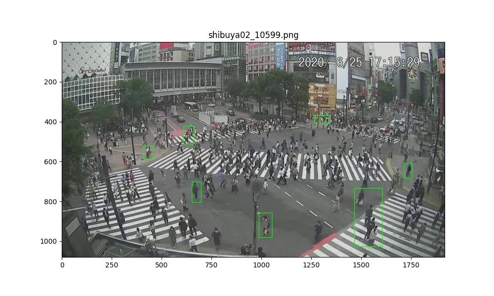
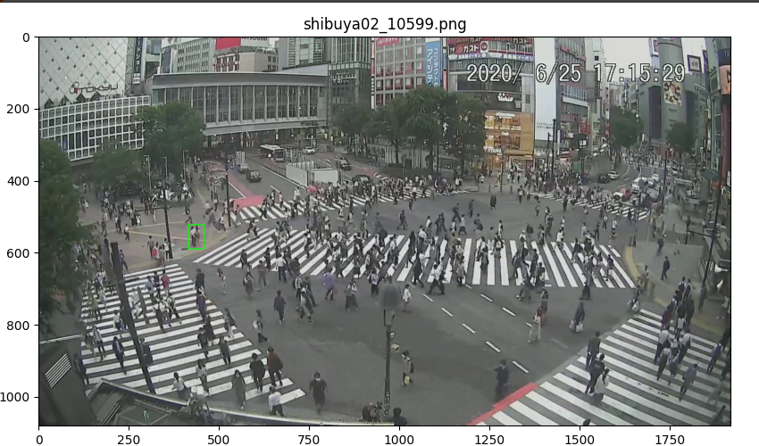
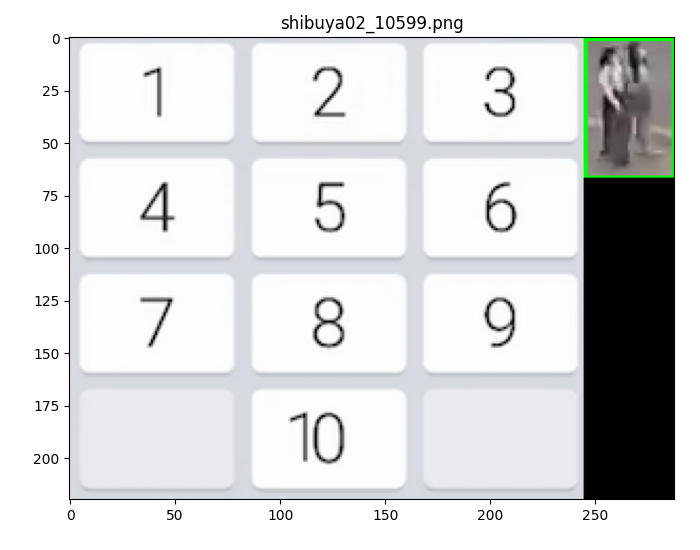

### Labeling People Counts


Labeling crowds of people manually will greatly aid our ML algorithm in determining number of people on screen.

This tool allows you to speedily and accurately label crowds.

The output "all_boxes.txt" is a csv containing picture names, coordinates of boxes, and the estimated number of people contained in that box. We don't need to save the bounding box images, because they can be created programmatically through the output file and the picture names if needed.
### Start the program
```
python3 label_runthrough.py -d DIRECTORY
```
where DIRECTORY is the location of your images (do not put other files in the DIRECTORY).

If you would like to start on a specific image (ordered alphabetically), run this
```
python3 label_runthrough.py -d DIRECTORY -s STARTING_IMAGE
```
where STARTING_IMAGE is the name of the image you're starting on. (e.g. 10599.png)

STARTING_IMAGE must be the actual name of file, otherwise no starting point will be found.

### Controls
Left Click: Create Bounding Box, Accept Bounding Box, Select Number of People

Right Click: Reset Bounding Box

Enter: Move on to Next Image

### Step 1: Create a bounding box
Bound a single person or a group of people.



#### Controls
First, Left Click the TOP LEFT of bounding box.

Second, Left Click the BOTTOM RIGHT of bounding box.

A bounding box should appear on the image.

Third, if you are satisfied with the box, Left Click INSIDE the bounding box.

If you want to redraw the box, Right Click anywhere on the window.

#### Notes

It is OK to include background imagery (but not vehicles or other objects of interest).

Try to include the whole bodies of people in the box, and try NOT to include partial bodies of people not counted.

Though people near the bottom of the screen may be easier, try to bound groups of people in all locations of the screen.

Do not select more than 10 people at a time.

### Step 2: Select number of people
Select the number of people bounded by your box.


#### Controls
Left Click on the number of people.

If you would like to redraw the box, Right Click anywhere on the window.

#### Notes
If you have done this correctly, you will see the following.
```
Added Row: shibuya02_10599.png;(416, 522);(459, 589);2
```
A row has been added to your output file.

If you have made an error and the row has been logged, you can manually delete the last row in the csv.

Do not manually type in any rows because there's a high likelihood of making errors in the coordinate system.

Repeat steps 1 and 2. Attempt to label some people in all regions of the screen. If it is hard to accurately access an area, it's OK to skip.
### Step 3: Move on to Next Image
After you have repeated Step 1 and 2 for many boxes, move on to the next image by pressing Enter or other Keyboard Key, while the main window is active.


